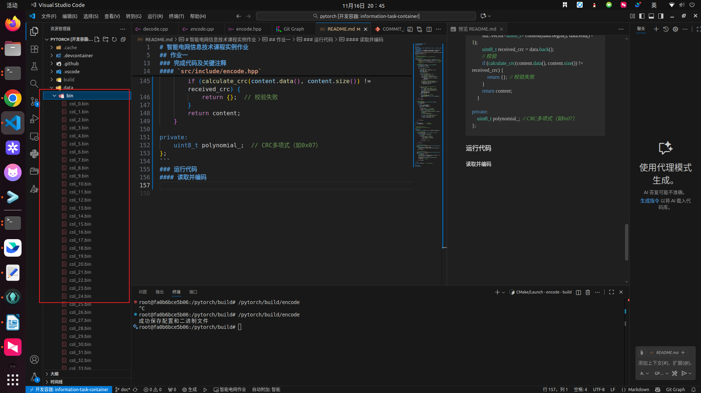
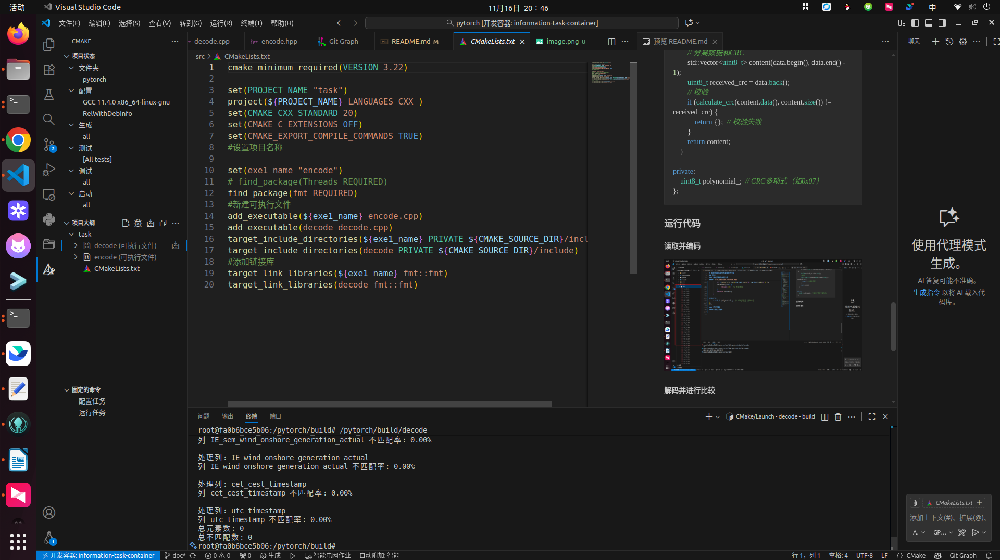
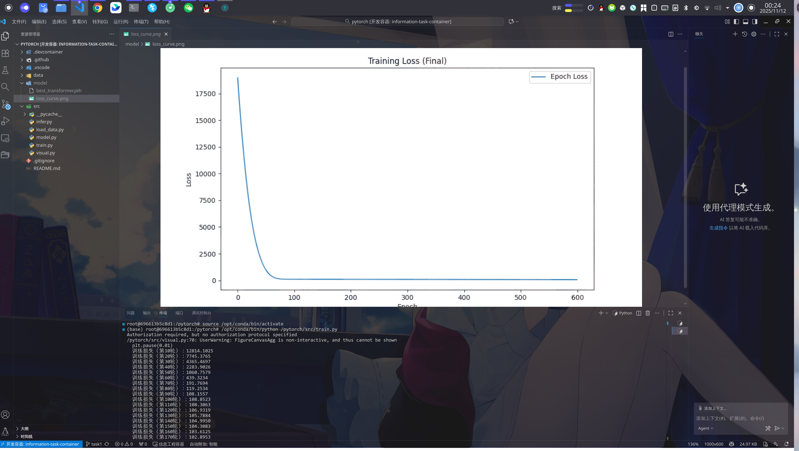
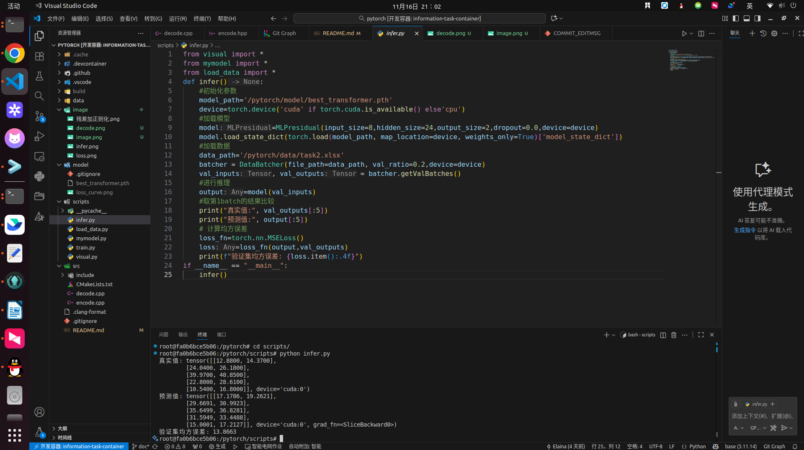

# 智能电网信息技术课程实例作业
### 学号 923110800627
### 姓名 柳宣泽

## 作业一
### 完成思路:
#### 处理对象: 从csv读取所有列数据，编码后放入json和二进制文件中，解码时候读取json和二进制文件
#### 采用方法:
- **LZ滑动窗口**: 使用400字节窗口和15字节前瞻缓冲区进行字符串匹配压缩
- **CRC循环冗余校验**: 对压缩数据按2048字节分块添加8位CRC校验码
#### 编成语言： 
C++17标准,使用`RapidCSV`库解析CSV,`nlohmann/json`库处理配置,fmt库格式化输出 
### 完成代码及关键注释
#### `src/include/encode.hpp`
- 核心算法代码
```cpp
/**
 * LZ77核心编码器（关键逻辑）
 * 核心：滑动窗口查找最长匹配，用偏移+长度编码重复序列
 */
class LZEncoderCore {
public:
    LZEncoderCore(int window_size = 2048, int lookahead_size = 18) 
        : window_size_(std::min(window_size, 2048)),  // 11位偏移最大支持2047
          lookahead_size_(std::min(lookahead_size, 18)) {}  // 最大匹配长度18

    // LZ77编码核心逻辑
    std::vector<uint8_t> encode(const std::string& data) {
        std::vector<uint8_t> output;
        size_t pos = 0;
        const size_t len = data.size();

        while (pos < len) {
            // 滑动窗口范围：[start, pos)
            size_t start = (pos >= window_size_) ? (pos - window_size_) : 0;
            uint16_t best_offset = 0;
            uint8_t best_len = 0;

            // 核心：查找窗口内最长匹配
            for (size_t i = start; i < pos; ++i) {
                uint8_t current_len = 0;
                // 匹配长度不超过前瞻缓冲区和数据边界
                while (current_len < lookahead_size_ && pos + current_len < len 
                       && data[i + current_len] == data[pos + current_len]) {
                    current_len++;
                }
                // 更新最优匹配（更长或同长但偏移更小）
                if (current_len > best_len || (current_len == best_len && (pos - i) < best_offset)) {
                    best_len = current_len;
                    best_offset = pos - i;
                }
            }

            // 编码：匹配长度≥3则用偏移+长度，否则单字符
            if (best_len >= 3) {
                // 第一字节：标志位0 + 偏移高7位
                uint8_t byte1 = (best_offset >> 4) & 0x7F;
                // 第二字节：偏移低4位 + 长度编码（长度-3）
                uint8_t byte2 = ((best_offset & 0x0F) << 4) | (best_len - 3);
                output.push_back(byte1);
                output.push_back(byte2);
                pos += best_len;
            } else {
                // 标志位1（最高位1）+ 字符ASCII
                output.push_back(0x80);  // 标志位
                output.push_back(static_cast<uint8_t>(data[pos]));
                pos++;
            }
        }
        return output;
    }

    // LZ77解码核心逻辑
    std::string decode(const std::vector<uint8_t>& data) {
        std::string result;
        size_t pos = 0;

        while (pos + 1 < data.size()) {
            uint8_t byte1 = data[pos];
            uint8_t byte2 = data[pos + 1];
            pos += 2;

            if (byte1 & 0x80) {  // 标志位1：单字符
                result += static_cast<char>(byte2);
            } else {  // 标志位0：偏移+长度
                // 解析11位偏移：byte1低7位 + byte2高4位
                uint16_t offset = ((byte1 & 0x7F) << 4) | ((byte2 >> 4) & 0x0F);
                // 解析长度：byte2低4位 + 3
                uint8_t len = (byte2 & 0x0F) + 3;

                // 从结果中复制匹配内容（核心：还原重复序列）
                size_t start = result.size() - offset;
                for (uint8_t i = 0; i < len; ++i) {
                    result += result[start + i];
                }
            }
        }
        return result;
    }

private:
    int window_size_;       // 滑动窗口大小
    int lookahead_size_;    // 前瞻缓冲区大小
};

/**
 * CRC校验核心（关键逻辑）
 * 核心：8位CRC计算，用于数据完整性校验
 */
class CRCCore {
public:
    CRCCore(uint8_t polynomial = 0x07) : polynomial_(polynomial) {}

    // 计算8位CRC（核心算法）
    uint8_t calculate_crc(const uint8_t* data, size_t len) {
        uint8_t crc = 0x00;
        for (size_t i = 0; i < len; ++i) {
            crc ^= data[i];  // 异或输入字节
            // 逐位处理
            for (int bit = 0; bit < 8; ++bit) {
                if (crc & 0x80) {  // 最高位为1
                    crc = (crc << 1) ^ polynomial_;
                } else {  // 最高位为0
                    crc <<= 1;
                }
                crc &= 0xFF;  // 保持8位
            }
        }
        return crc;
    }

    // 带CRC编码（数据+校验值）
    std::vector<uint8_t> encode_with_crc(const std::vector<uint8_t>& data) {
        std::vector<uint8_t> output = data;
        output.push_back(calculate_crc(data.data(), data.size()));  // 附加CRC
        return output;
    }

    // CRC校验解码（失败返回空）
    std::vector<uint8_t> decode_with_crc(const std::vector<uint8_t>& data) {
        if (data.empty()) return {};
        // 分离数据和CRC
        std::vector<uint8_t> content(data.begin(), data.end() - 1);
        uint8_t received_crc = data.back();
        // 校验
        if (calculate_crc(content.data(), content.size()) != received_crc) {
            return {};  // 校验失败
        }
        return content;
    }

private:
    uint8_t polynomial_;  // CRC多项式（如0x07）
};
```
#### `src/decode.cpp`
- 读取bin json进行解码并与原始值比较
```cpp
int main()
{

    // 路径配置
    const std::string csv_path = "/pytorch/data/task1.csv";
    const std::string json_config_path = "/pytorch/data/task1_config.json";
    const std::string bin_dir = "/pytorch/data/bin/";

    // 1. 读取配置文件
    std::ifstream config_file(json_config_path);
    if (!config_file.is_open())
    {
        throw std::runtime_error("无法打开配置文件: " + json_config_path);
    }

    json config;
    config_file >> config;
    config_file.close();

    // 解析配置参数
    const int window_size = config["window_size"];
    const int lookahead_buffer_size = config["lookahead_buffer_size"];
    const int crc_polynomial = config["crc_polynomial"];
    const size_t crc_block_size = config["crc_block_size"];

    // 初始化解码器（假设编码器类同时包含解码方法，或有对应的解码器类）
    CRCCoder_t CRC(crc_polynomial, crc_block_size);
    LZEncoder_t LZ(window_size, lookahead_buffer_size); // 假设包含decode方法

    // 2. 读取原始CSV文件
    rapidcsv::Document doc(csv_path);

    // 3. 处理所有列
    size_t total_mismatches = 0;
    size_t total_elements = 0;

    for (const auto &[column_name, bin_filename] : config["columns"].items())
    {
        fmt::print("\n处理列: {}\n", column_name);

        // 3.1 读取二进制编码文件
        const std::string bin_path = bin_dir + bin_filename.get<std::string>();
        std::vector<uint8_t> crc_encoded = LoadBinaryFile(bin_path);

        // 3.2 解码流程（先CRC解码，再LZ解码）
        std::vector<uint8_t> lz_encoded = CRC.Decode(crc_encoded);
        std::vector<std::string> decoded_data = LZ.Decode(lz_encoded);

        // 3.3 获取原始数据
        std::vector<std::string> original_data = doc.GetColumn<std::string>(column_name);

        // 3.4 比较原始数据与解码数据
        uint32_t column_mismatches = 0;

        if (decoded_data.size() != original_data.size())
        {
            fmt::print("警告: 数据长度不匹配！原始: {} 解码: {}\n",
                       original_data.size(), decoded_data.size());
            // 以较短的长度进行比较
            uint32_t compare_len = std::min(original_data.size(), decoded_data.size());
            total_elements += compare_len;

            for (auto i = 0; i < compare_len; ++i)
            {
                if (decoded_data[i] != original_data[i])
                {
                    column_mismatches++;
                    if (column_mismatches <= 5)
                    { // 只显示前5个不匹配项
                        fmt::print("位置 {} 不匹配 - 原始: '{}' 解码: '{}'\n",
                                   i, original_data[i], decoded_data[i]);
                    }
                }
            }
        }
        // 统计结果
        total_mismatches += column_mismatches;
        fmt::print("列 {} 不匹配率: {:.2f}%\n",
                   column_name, (column_mismatches * 100.0) / original_data.size());
    }

    // 4. 输出总体比较结果
    fmt::print("总元素数: {}\n", total_elements);
    fmt::print("总不匹配数: {}\n", total_mismatches);

    return 0;
}
```
#### `src/encode.cpp`

- 读取csv并编码
```cpp
int main()
{
    const std::string csv_path = "/pytorch/data/task1.csv";
    const std::string json_config_path = "/pytorch/data/task1_config.json";
    const std::string bin_dir = "/pytorch/data/bin/"; // 二进制文件存放目录

    // 创建二进制目录（如果不存在）
    std::filesystem::create_directories(bin_dir);

    rapidcsv::Document doc(csv_path);
    const int window_size = 400;
    const int lookahead_buffer_size = 15;
    const int crc_polynomial = 0x07;
    const size_t crc_block_size = 2048;

    CRCCoder_t CRC(crc_polynomial, crc_block_size);
    LZEncoder_t LZ(window_size, lookahead_buffer_size);

    // JSON仅保存配置和二进制文件索引
    nlohmann::json json_config;
    json_config["window_size"] = window_size;
    json_config["lookahead_buffer_size"] = lookahead_buffer_size;
    json_config["crc_polynomial"] = crc_polynomial;
    json_config["crc_block_size"] = crc_block_size;
    json_config["columns"] = nlohmann::json::object(); // 存储列名到二进制文件的映射

    // 处理前3列
    for (int column_id = 0; column_id < doc.GetColumnCount(); ++column_id)
    {
        const std::string column_name = doc.GetColumnName(column_id);
        std::vector<std::string> column_data = doc.GetColumn<std::string>(column_id);

        // 编码流程
        std::vector<uint8_t> lz_encoded = LZ.Encode(column_data);
        std::vector<uint8_t> crc_encoded = CRC.Encode(lz_encoded);

        // 保存二进制数据到单独文件
        const std::string bin_filename = fmt::format("col_{}.bin", column_id);
        const std::string bin_path = bin_dir + bin_filename;
        writeBinary(bin_path, crc_encoded);

        // 在JSON中记录映射关系
        json_config["columns"][column_name] = bin_filename;
    }

    // 保存配置JSON
    std::ofstream json_file(json_config_path);

    //省略下面
}
```
### 运行代码
#### 读取并编码

#### 解码并进行比较

--- 
## 作业二

### 完成思路
#### 处理对象
excel 表格中的数值型数据（X1-X8 作为输入特征，Y1-Y2 作为输出目标）
#### 采用方法
- 使用带残差连接的多层感知机（MLP）进行回归预测
- 通过 Adam 优化器和均方误差损失函数进行模型训练
- 将原始数据按照0.8 0.2比例以 [batch_size,feature_size]的张量划分训练集数据集
#### 编程语言及版本：
Python 3.11，使用 `PyTorch` 深度学习框架，`pandas` 处理数据，`matplotlib` 可视化训练过程
> 所有的环境打包进dockerfile
### 关键部分代码和注释
#### `scripts/mymodel.py`
- 模型部分代码
```python
class MLPresidual(nn.Module):
    """带有残差连接的多层感知机模型"""
    
    def __init__(self, input_size, hidden_size, output_size,dropout=0.1, device=torch.device('cpu')):
        super().__init__()
        # 残差块：先升维再降维，确保与原始输入维度一致
        self.residual_block = nn.Sequential(
            nn.Linear(input_size, hidden_size),  # 升维到hidden_size
            nn.ReLU(),
            nn.Dropout(dropout),
            nn.Linear(hidden_size, input_size)   # 降维回input_size，确保与残差相加
        )
        # 输出层：处理残差后的特征
        self.output_layer = nn.Sequential(
            nn.Linear(input_size, hidden_size),
            nn.ReLU(),
            nn.Linear(hidden_size, output_size)
        )
        self.device = device
        self.to(device)  # 移动模型到目标设备

    def forward(self, x: torch.Tensor) -> torch.Tensor:
        """前向传播函数，包含残差连接"""
        assert isinstance(x, torch.Tensor), "输入必须是torch.Tensor类型"
       
        x = x.to(self.device)
        residual = x  # 保存原始输入作为残差
        # 残差块计算
        x = self.residual_block(x)
        x = x + residual  # 残差连接（核心：当前输出+原始输入）
        # 输出层
        x = self.output_layer(x)
        
        return x
```
#### `scripts/train.py`
```python
from visual import *
from mymodel import *
from load_data import *

def train():
    """模型训练函数"""
    # 设置设备（GPU优先）
    device=torch.device('cuda' if torch.cuda.is_available() else'cpu')
    
    # 初始化模型（带残差连接的MLP）
    model=MLPresidual(input_size=8,hidden_size=24,output_size=2,dropout=0.1,device=device)
    
    # 数据和模型路径配置
    data_path='/pytorch/data/task2.xlsx'
    model_path='/pytorch/model/'
    
    # 初始化数据加载器
    batcher = DataBatcher(file_path=data_path, val_ratio=0.2,device=device)
    train_inputs, train_outputs = batcher.getTrainBatches()
    val_inputs, val_outputs = batcher.getValBatches()
    
    # 定义损失函数和优化器
    loss_fn=torch.nn.MSELoss()  # 均方误差损失（回归任务）
    optimizer=torch.optim.Adam(model.parameters(),lr=0.005)  # Adam优化器

    # 初始化可视化工具
    visual=SaveAndVisual(model_dir=model_path, loss_img_path=model_path+'loss_curve.png')
    num_epoch=600  # 训练轮数
    
    # 加载已保存的模型（如果存在）
    visual.loadModel(model,optimizer,device)
    
    # 训练循环
    for epoch in range(num_epoch):
        model.train()  # 训练模式
        inputs=train_inputs
        targets=train_outputs
        
        # 梯度清零
        optimizer.zero_grad()
        
        # 前向传播
        outputs=model(inputs)
        
        # 计算损失
        loss=loss_fn(outputs,targets)
        
        # 反向传播和参数更新
        loss.backward()
        optimizer.step()
        
        # 更新可视化
        visual.updateVisualization(epoch,loss.item())
    
    # 训练结束，保存最终可视化结果
    visual.finalizeVisualization()

if __name__ == "__main__":
    train()
```

#### `scripts/infer.py`
```python
from visual import *
from mymodel import *
from load_data import *

def infer():
    """模型推理函数"""
    # 初始化参数
    model_path='/pytorch/model/best_transformer.pth'
    device=torch.device('cuda' if torch.cuda.is_available() else'cpu')
    
    # 加载模型
    model=MLPresidual(input_size=8,hidden_size=24,output_size=2,dropout=0.0,device=device)
    model.load_state_dict(torch.load(model_path, map_location=device, weights_only=True)['model_state_dict'])
    model.eval()  # 推理模式
    
    # 加载数据
    data_path='/pytorch/data/task2.xlsx'
    batcher = DataBatcher(file_path=data_path, val_ratio=0.2,device=device)
    val_inputs, val_outputs = batcher.getValBatches()
    
    # 进行推理（关闭梯度计算）
    with torch.no_grad():
        output=model(val_inputs)
    
    # 取前5个结果比较
    print("真实值:", val_outputs[:5])
    print("预测值:", output[:5])
    
    # 计算均方误差
    loss_fn=torch.nn.MSELoss()
    loss=loss_fn(output,val_outputs)
    print(f"验证集均方误差: {loss.item():.4f}")

if __name__ == "__main__":
    infer()
```
### 运行截图
#### 多层感知机训练

#### 多层感知机推理


#### 更改模型后的推理
